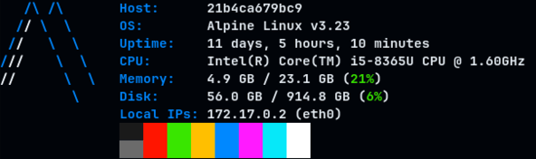
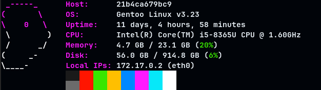

<div align="center">
    <h1>zFetch</h1>
    
    <h6><i>Lightweight system information fetcher for Linux.</i></h6>


</div>

**zFetch** is a lightweight system information fetcher for Linux written in C99.
Unlike other system fetchers, this tool focuses on providing a simple, easy-to-remember
interface and configuration syntax, extremely fast startup and a reasonable amount
of core features.

## Installation
zFetch consists on a single source file which can be compiled with any modern C
compiler (Clang/GCC) on a Linux-based system. In order to build it, you can just run
`gcc zfetch.c -o zfetch` or use the following Makefile rule:

```sh
$ make clean all
rm -f *.o *.a zfetch
clang -Wall -Wextra -Werror -pedantic-errors -Wwrite-strings -std=c99 -O3 zfetch.c -o zfetch
```

In both cases, you will get a binary file named `zfetch` that you can move wherever you
want.

## Usage
As stated before, I've built zFetch to be extremely simple to use since I believe that system
fetchers play a paramount role on providing essential data to whoever has a lot of machines to manage.

In its most basic form, you can just invoke the program without any additional parameter and it will
run with all option enabled, that is:



If you instead would like to granularly enable or disable some features,
you can do so by creating a configuration file in one of the following paths:

- `$HOME/.zfetch.conf`;  
- `$HOME/.config/zfetch/conf` (**this takes precedence**).

Inside it, you can specify which option to enable and which one to disable:

```conf
HOST   = 1
OS     = 0
UPTIME = 1
CPU    = 1
MEMORY = 1
DISK   = 1
IP     = 1
LOGO   = 1
BARS   = 0
```

Any other line will be considered invalid and silently skipped by the builtin parser.
To retrieve which options are currently enabled, you can run the program with the `-s` flag, that is:

```sh
$ ./zfetch  --list-opts # or -s
HOST   : ON
OS     : OFF
UPTIME : ON
CPU    : ON
MEMORY : ON
DISK   : ON
IP     : ON
LOGO   : ON
BARS   : OFF
```

You can also dynamically specify a different path by using the `-c` CLI argument:

```sh
$ ./zfetch  -c $PWD/config -s
Using custom config file: '/home/marco/Projects/zfetch/config'
HOST   : OFF
OS     : OFF
UPTIME : OFF
CPU    : OFF
MEMORY : ON
DISK   : ON
IP     : ON
LOGO   : OFF
BARS   : ON
```

Finally, you can list all supported distribution, using the `--list-logos/-a` flag:

```sh
$ /zfetch -a
Available logos: alpine, arch, debian, fedora, mint, gentoo, artix, linux, nixos, redhat, slackware, suse, ubuntu.
```


## License

[MIT](https://choosealicense.com/licenses/mit/)